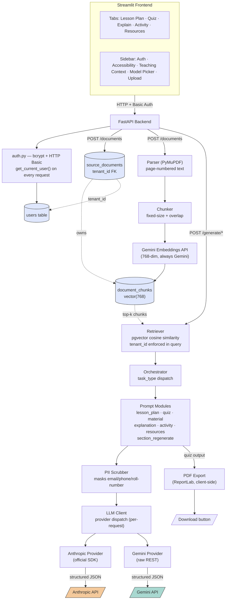

# Architecture diagram — generation prompt

Paste the block below into an AI diagramming tool (Eraser.io "DiagramGPT", Whimsical AI, Napkin.ai, or a general image-gen tool if you want a stylized poster version). It describes the **as-built** system, not the original target design.

---

## Prompt

> Draw a system architecture diagram for a web app called **MyLesson.ai**, an AI teaching assistant. Use a clean, modern software-architecture diagram style with labeled boxes and directional arrows, grouped into layers left-to-right or top-to-bottom.
>
> **Layers and components:**
>
> 1. **Client layer:** A single box "Streamlit Frontend" containing five sub-modes shown as tabs: Lesson Plan, Quiz, Explain a Concept, Activity Ideas, Resources. Note a sidebar containing: Auth (login/register), Accessibility controls (large text / high contrast / reduce motion), Teaching Context fields, Model picker (Provider + Model), Source Document upload.
>
> 2. **API layer:** A box "FastAPI Backend" that the client talks to over HTTP with Basic Auth. Inside it, show these endpoint groups: `/auth/*` (register, me), `/documents` (upload, list), `/generate/*` (lesson-plan, quiz, resources, explanation, activity), `/providers`.
>
> 3. **Auth layer:** A small box "auth.py — bcrypt + HTTP Basic" connected to the API layer and to a "users" table in the database. Label the connection "get_current_user() dependency on every request."
>
> 4. **Ingestion pipeline** (triggered by document upload): a left-to-right chain: "PDF Upload" → "Parser (PyMuPDF, page-numbered)" → "Chunker (fixed-size + overlap)" → "Gemini Embeddings API (768-dim)" → "Postgres: document_chunks (pgvector)".
>
> 5. **Retrieval + Generation pipeline** (triggered by a generate request): "Retriever (pgvector cosine similarity, tenant_id filter)" → "Orchestrator (task_type dispatch)" → one of 7 "Prompt Modules" (lesson_plan, quiz, material, explanation, activity, resources, section_regenerate) → "LLM Client (provider dispatch)" → branches to two boxes: "Anthropic Provider (SDK)" and "Gemini Provider (raw REST)", each going out to its respective external API icon (Anthropic API, Gemini API).
>
> 6. **Database:** One Postgres box (with a pgvector badge/icon) containing three labeled tables: `users`, `source_documents` (tenant_id FK), `document_chunks` (vector(768) column). Draw dashed lines from both `source_documents` and `document_chunks` back to `users`, labeled "tenant_id — enforced in every query, not just the endpoint."
>
> 7. **Cross-cutting, drawn as a small badge/icon attached to the LLM Client box:** "PII Scrubber — regex-masks email/phone/roll-number before every prompt."
>
> 8. **Output:** From the Quiz prompt module, draw a side branch to a box "PDF Export (ReportLab)" leading to a download icon, labeled "client-side, renders directly from session state."
>
> **Style notes:** Use a professional, slightly technical palette (blues/grays with one accent color for the LLM provider split, e.g. orange for Anthropic and teal for Gemini). Label every arrow with what flows across it (e.g. "HTTP + Basic Auth", "embeds text", "top-k chunks", "structured JSON"). Keep the two external LLM APIs visually distinct from the internal boxes (e.g. cloud-shaped icons) to make clear they're third-party.

---

## Ready-to-render alternative (Mermaid)

No external tool needed — this renders directly on GitHub, in most Markdown viewers, and in Mermaid Live Editor (mermaid.live).

